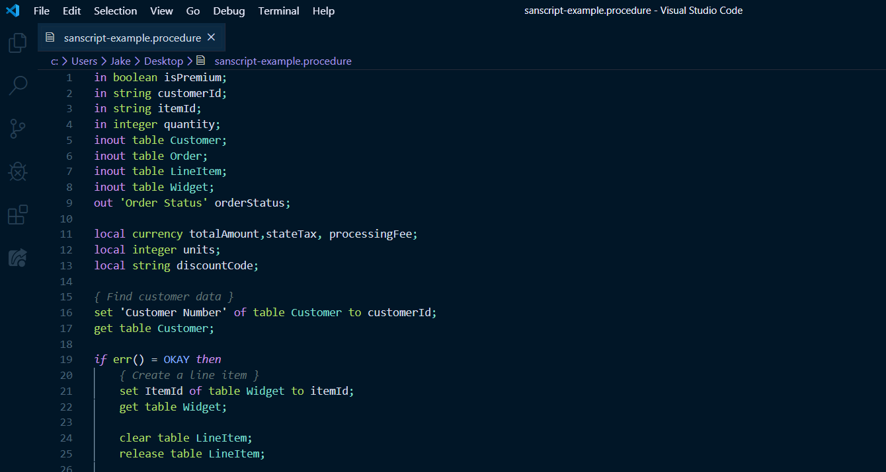
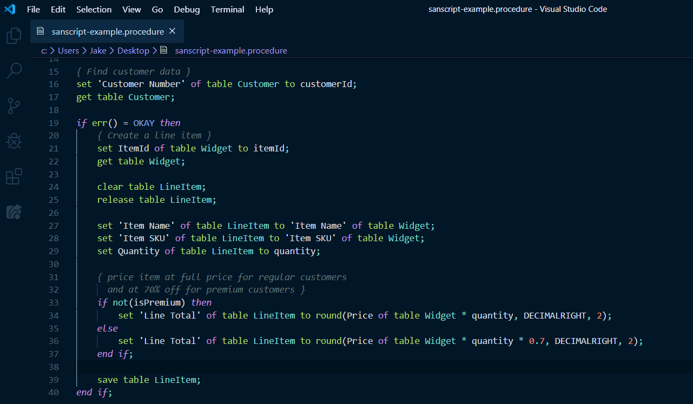

# Sanscript Syntax Highlighter README

This extension provides syntax highlighting support for Sanscript, a scripting language used when writing Dexterity applications. Dexterity is a lesser known Microsoft Dynamics GP programming language created in the 90s.

## Features

Provides syntax highlighting support Sanscript code written in files with .function or .procedure file extensions.

## Requirements

If you use this extension with files created by the export functionality of a Dexterity dictionary, you will need to remove the the opening and closing brackets on the first and last lines of the file as well as the double quotes that begin after the label "Script" in the header of the file and end at the bottom of the file for the extension to work. If there are string literals in your exported file, you will also need to remove the backslash before each double quote.

If you are copying\pasting the code directly from the Dexterity dictionary you will not need to make any manual changes to the file. Just be sure to use the .function or .procedure file extension for the syntax highlighting to take effect.

## Extension Settings

Include if your extension adds any VS Code settings through the `contributes.configuration` extension point.

For example:

This extension contributes the following settings:

-   `myExtension.enable`: enable/disable this extension
-   `myExtension.thing`: set to `blah` to do something
